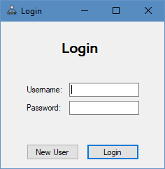
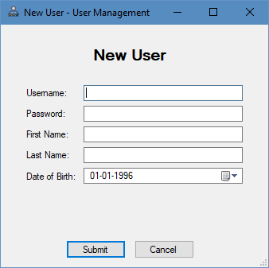
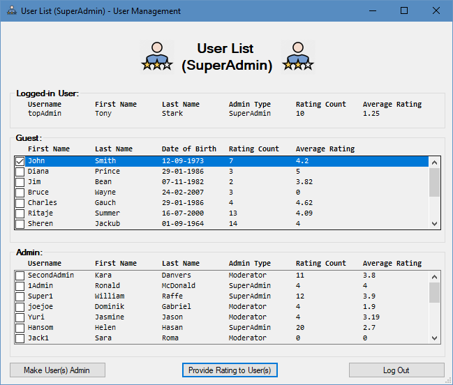
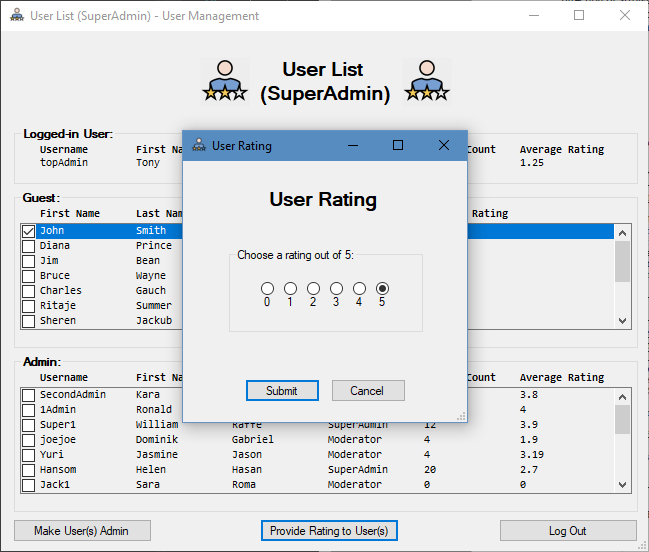
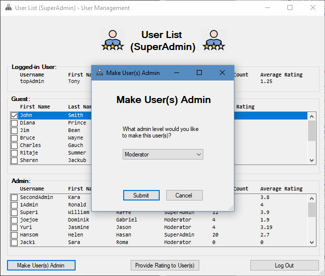

# User Management System

Windows Forms application of User Management System created for **31927 Application Development with .NET** course at UTS.

It allows existing users to login, new users to be added, for users to see a list of other users, and for the users to provide ratings (from 0 to 5) on other users. It also allows administrators to promote reputation of other users.

## Previews

  

  

  

  

  

